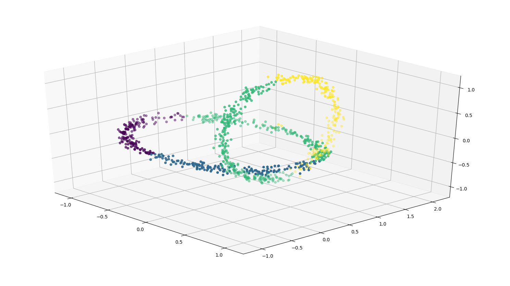

# KMeans implementation using CUDA

This project implements parallel version of kmeans algorithm using CUDA. 

## What is kmeans?
Kmeans is a clustering algirithm. It's goal is to given some set of n points of d-dimensional data assign them to clusters.
Cluster is a set of points that are in some sense close to each other (in our case close means having low euclidian distance from each other).

Below is example visualization of 3-dimensional points assigned to k=4 clusters.

### Algorithm
Input: vector of points, integer k
1. Randomly assign k centroids (for example to first k points in input array)
2. Compute the Euclidean distance from each of the points to each cluster center. Assign each point to closest centroid
(assign label from 0 to k-1)
3. Recompute centroids with means of points assigned to each centroid.
4. Stop if converged, otherwise repeat from 2.

## Implementation details

I implement k-means for 3-dimensional points using float3 type. The structure I use is vector of structures (instead of structure of vectors - 3 vectors of x, y and z coordinates which would allow for coalesced memory access and probably a better performance).

As for algorithm, 2nd step is just simple instance of map operation on the set of points which is trivially parallelizable.
More thought must go into 3rd step (computing mean across labels).
I consider three approaches of parallel execution here: reduce-by-key, gather and scatter.

### Reduce by key
Since thrust doesn't support reduce_by_key with keys being not sorted (https://thrust.github.io/doc/group__reductions_ga1fd25c0e5e4cc0a6ab0dcb1f7f13a2ad.html#ga1fd25c0e5e4cc0a6ab0dcb1f7f13a2ad),
I implemented my own kernel doing that. It's easier, since I know that keys (labels of points)
are numbered from 0 to k-1. It's a variation of sum-reduce (https://github.com/CoffeeBeforeArch/cuda_programming/tree/master/sumReduction),  only that partial sums are vectors representing sums for each key.  I think it's nicer than sorting by key all the points in each iteration and using thrust::reduce_by_key.

Code for this is ugly, don't look at it.

### Scatter
Assign each thread to some index in points vector. Each thread reads element from global memory.
Then, they calculate sum and count using atomic writes to global vector of means and counts.

### Gather
Assign each block to computing some mean. Threads in a block are assigned to read from chunks of points vector and perform partial reduction using shared memory.
Since synchronization in a block is easy we can do it in one clean kernel execution with non-conflicting writes to global memory.
In the end first thread (representing the whole block) divides sum of elements by their count, which produces desired mean.